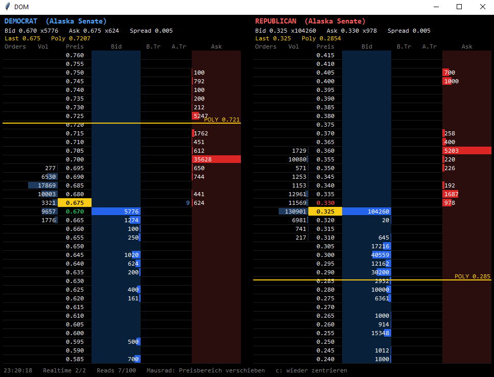
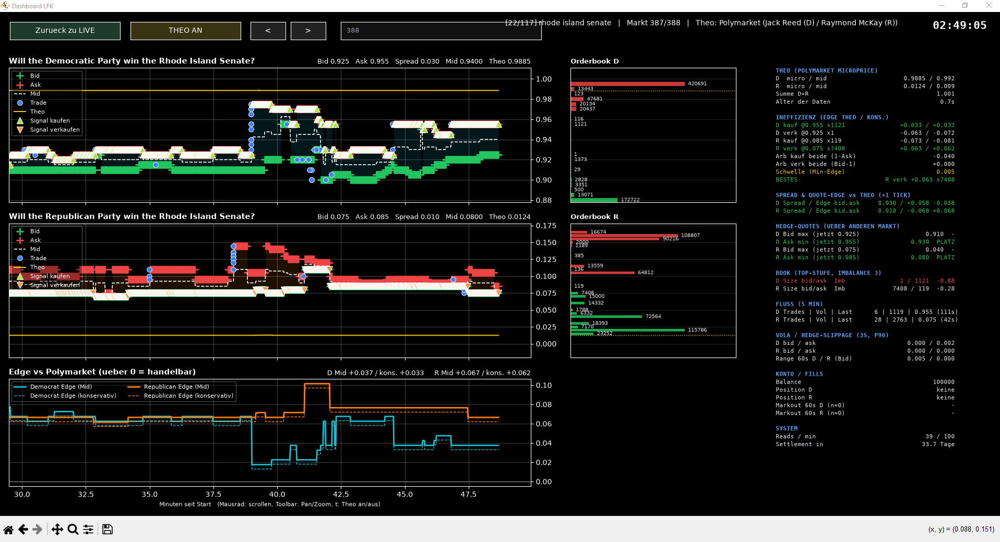
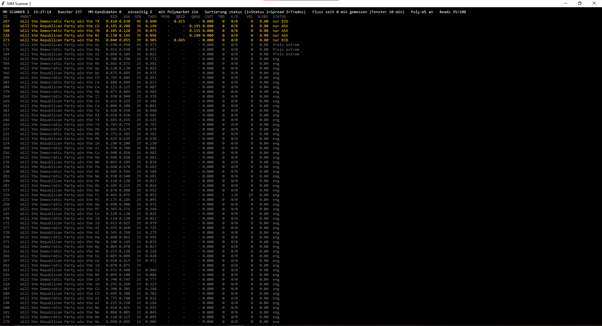

# Prediction Market MM Dashboard

Market making dashboard with a live DOM ladder for prediction markets, built for the Susquehanna Predictions Cup.

## TL;DR

Three Python tools for the **Susquehanna Predictions Cup**:

- **DOM ladder:** order book of both contracts as a ladder, with the Polymarket fair value drawn as a line
- **Live market monitor:** price charts (best bid, best ask, mid, trades) compared to the Polymarket fair value, with buy and sell signals and arbitrage
- **MM scanner:** ranks which markets are worth quoting

Put your **API key** into `KEY`, install the requirements and run the tool you want.

## Tools

### DOM ladder (`dom.py`)



- Order book of the **Democratic** and **Republican** contract as a ladder
- **Polymarket fair value** drawn as a line at its exact price
- Depth, volume, buyer and seller trades per price level
- Your own **open orders** in a separate column
- **Mouse wheel** moves the price range, `c` recenters

The DOM shows one market at a time. To change it, **edit these variables directly at the top of `dom.py`**:

```python
NAME = "Alaska Senate"
M_D, M_R = "377", "378"
POLY_D = "will-mary-peltola-win-the-alaska-senate-race-in-2026"
POLY_R = "will-dan-sullivan-win-the-alaska-senate-race-in-2026"
```

- **`NAME`:** title shown above the ladders
- **`M_D`, `M_R`:** Susquehanna market ids of the Democratic and Republican contract
- **`POLY_D`, `POLY_R`:** Polymarket slugs of the matching markets, used for the fair value line

### Dashboard (`dash_user_v2.3.py`)



- Goes through all Democrat/Republican markets, press `/` and type a **market id** to jump to one
- Bid, ask, mid, trades and **Polymarket theo** for both contracts
- **Buy and sell signals** when a contract is undervalued or overvalued
- Chart of the **edge versus the Polymarket theo**
- Order book ladder for each contract, `t` toggles the theo

The **side panel** shows the indicators:

- **Theo:** Polymarket microprice for both contracts, their sum and the age of the data
- **Inefficiency:** edge of each side versus the theo, and the **arbitrage** edge of buying or selling both contracts at once
- **Spread and quote edge:** edge of a quote one tick inside the spread
- **Hedge quotes:** best bid and ask you could post given the price on the other contract
- **Book:** top of book sizes and imbalance
- **Flow:** trades, volume and last trade of the last five minutes
- **Volatility and hedge slippage:** short term price moves, which also set the signal threshold
- **Account and fills:** balance, positions and markouts after your fills
- **System:** API reads per minute and time to settlement

### MM scanner (`mm_scanner.py`)



- Table of all order books with bid, ask, spread, Polymarket theo and trades
- Shows the **quotes to post** (one tick inside the spread) and the **profit per round trip**
- **Score** from the spread, the theo and the trades of the last 10 minutes
- **Green:** quoting both sides makes sense. **Yellow:** only one side or a risky market
- Press `1`, `2` or `3` to sort, **double click** a row to open it in the dashboard

**Parameters:** all thresholds of the scanner can be **changed directly in `mm_scanner.py`**.

## Setup

```bash
git clone https://github.com/lennyfin/prediction-market-mm-dashboard.git
cd prediction-market-mm-dashboard
pip install requests numpy matplotlib websocket-client
```

Put your own **Susquehanna Predictions Cup API key** into the `KEY` variable at the top of `dom.py` and `dash_user_v2.3.py`:

```python
KEY = "your_api_key_here"
```

Then run a tool:

```bash
python dom.py
python dash_user_v2.3.py
python mm_scanner.py
```

Built for a trading competition. Not financial advice
